# Instalació d'ownCloud amb IsardVDI

# Instal·lar la versió 7.4 de php

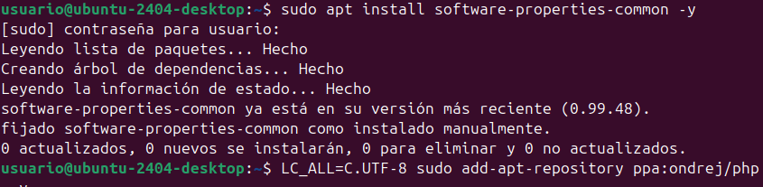

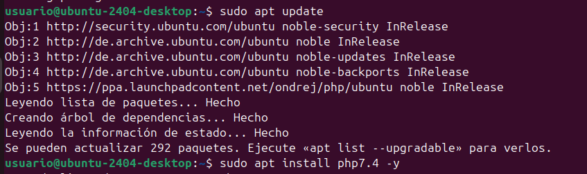

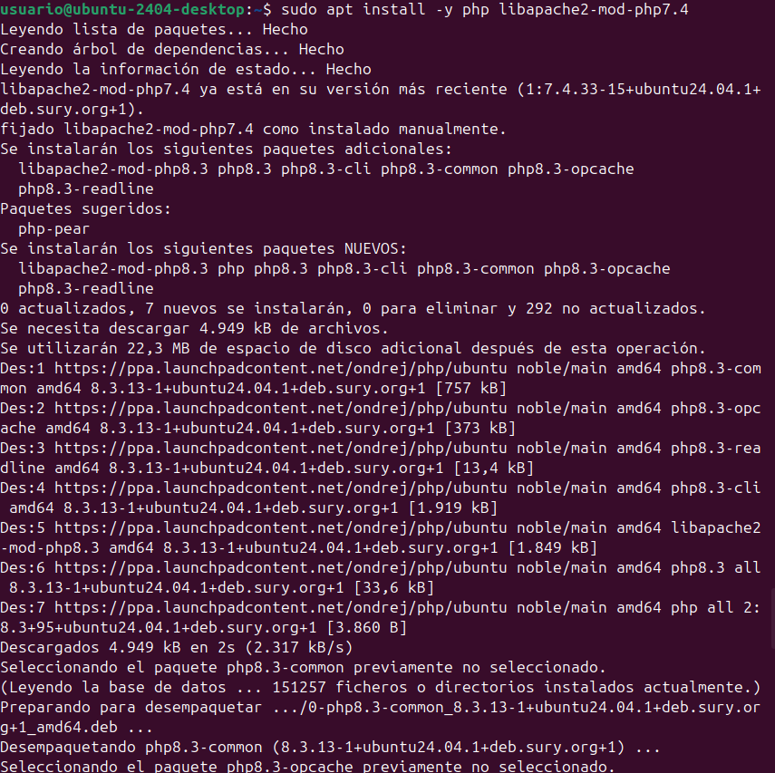

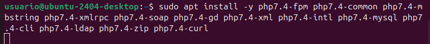

Ara, hem de seleccionar la versió de php que volem instal·lar, que és la 7.4. Escrivim, en aquest cas, "1" per seleccionar-la i li donem a enter.

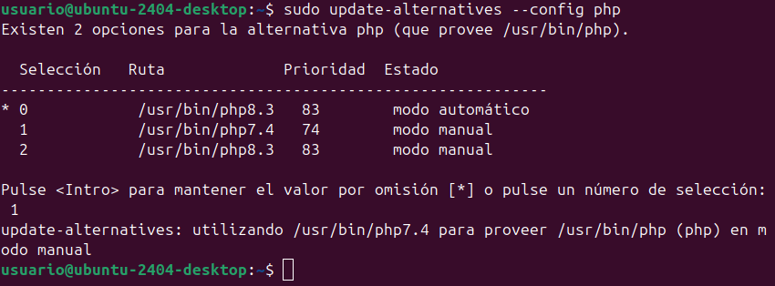

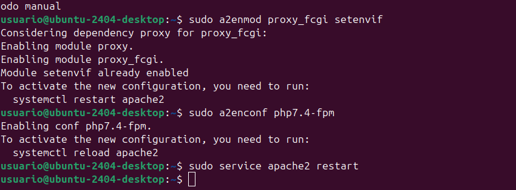

Ara sí, anem amb ownCloud. El primer que hem de fer és actualizar la màquina i instal·lar apache2, el servidor web i mysql, el servidor de bases de dades.

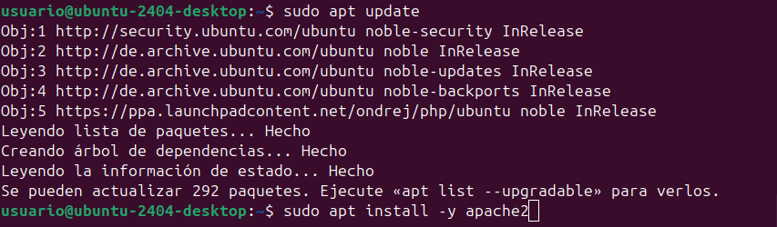

Instal·larem algunes llibreries de php i reiniciem apache2.

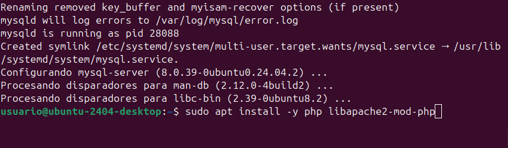

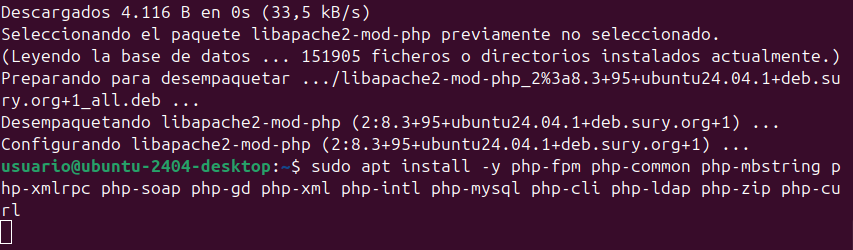

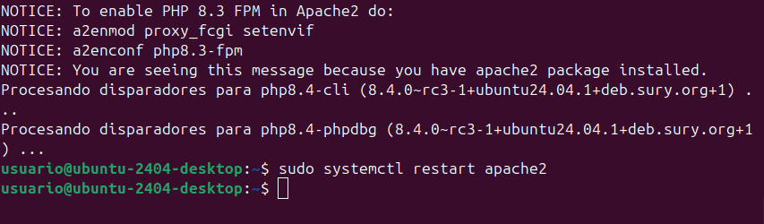

Accedim a la consola de mysql, on creem la base de dades, un usuari i li donem privilegis. Seguit, probarem la connexió a la base de dades. Si ens deixa iniciar sessió amb l'usuari que hem creat, anem bé.

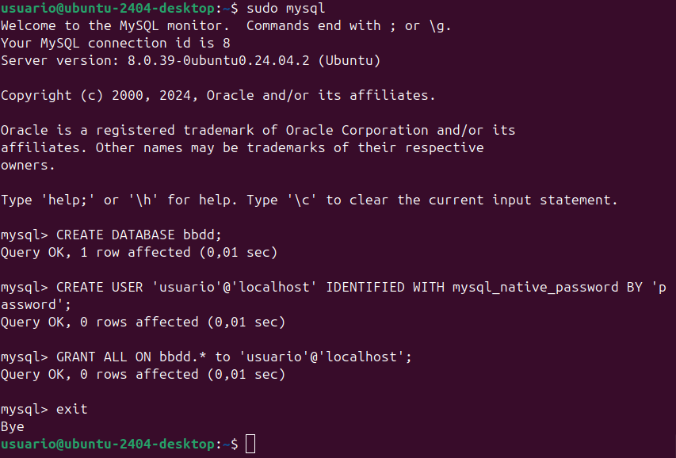

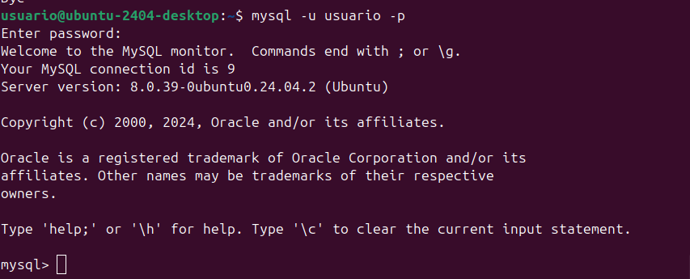

Per permetre la connexió des d'una màquina remota, primer hem de cambiar aquest paràmetre. Accedirem a l'arxiu i l'editarem amb `vim /etc/mysql/mysql.conf.d/mysqld.cnf`. Hem de canviar `bind-address = 127.0.0.` per `bind-address = 0.0.0.`

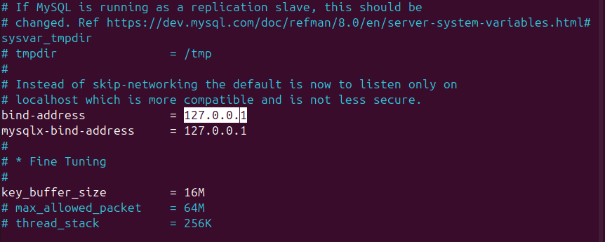

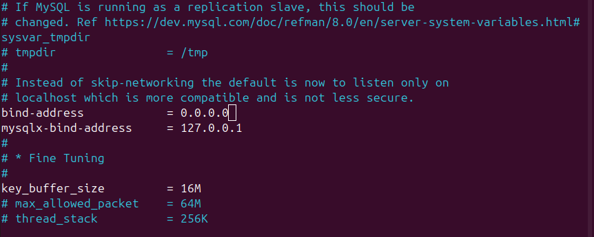

Ara, reiniciem mysql amb `systemctl restart mysql`

Creem un usuari per accedir des d'una màquina remota

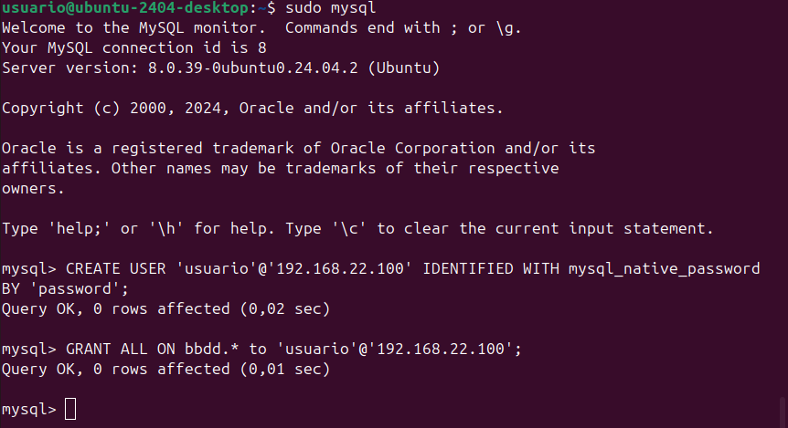

Descarreguem [ownCloud](https://download.owncloud.com/server/stable/owncloud-complete-20240724.zip), movem el .zip a la carpeta on el volem descomprimir i el descomprimim.

Per últim, també aplicarem permisos a les nostres aplicacions web.

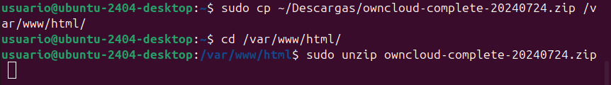

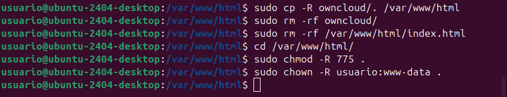

Si ara anem a [http://localhost/](http://localhost/), hauría d'aparèixer això.

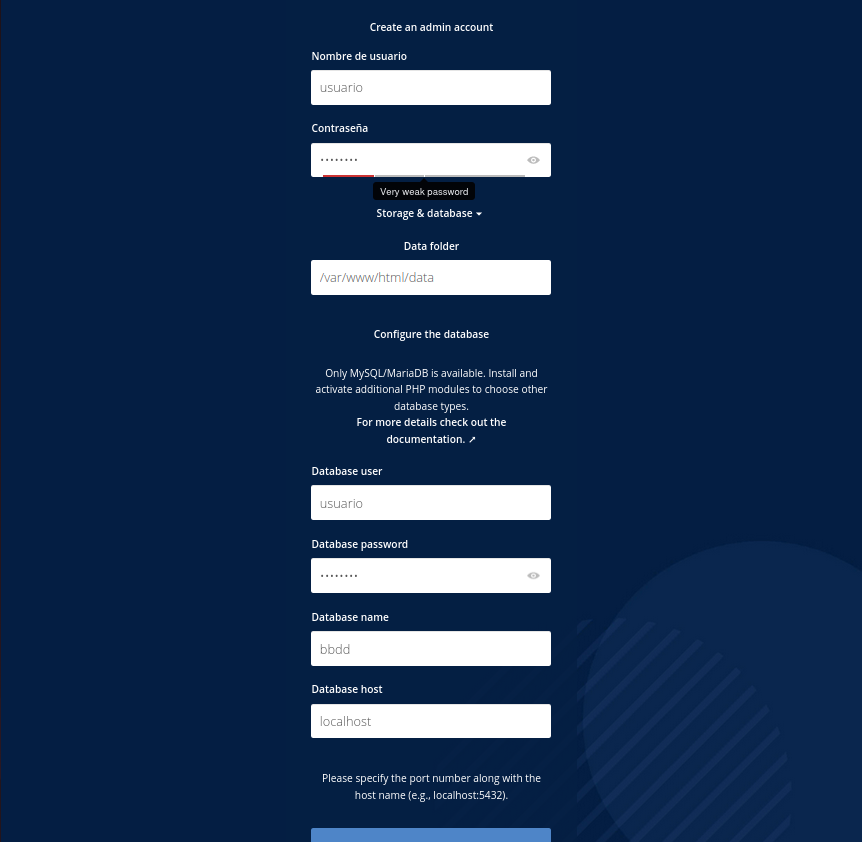

- A "create admin account", creem el compte d'administrador
- A "database user" hem de posar les credencials que hem posat al crear la nostra base de dades al terminal.
